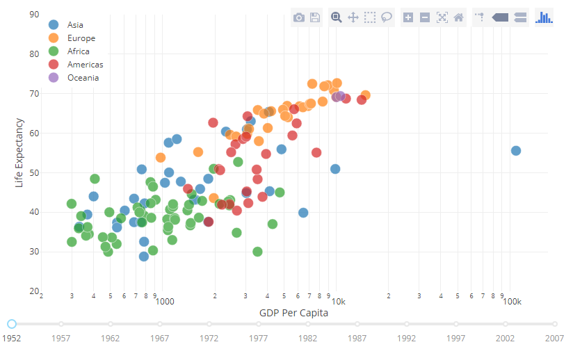
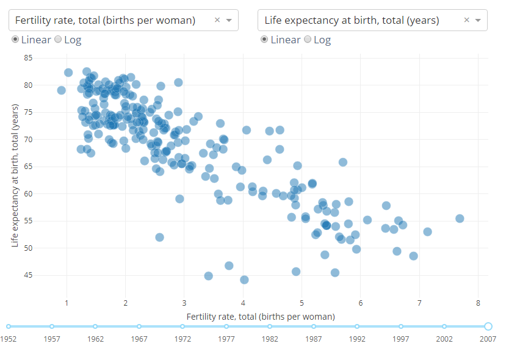

## Part2 Dash基础回调函数

Dash应用程序通过Dash回调函数实现交互：当输入组件的属性发生变化时，自动调用编写好的Python函数。可以把多个回调函数链接起来，即UI输入组件中的一个变动，触发整个应用程序中的几个变动。

#### 更新库

```
pip install dash==0.20.0    # 核心dash后端
pip install dash-renderer==0.11.2    # dash前端
pip install dash-html-components==0.8.0    # HTML组件
pip install dash-core-components==0.18.0    # Supercharged components
pip install plotly==2.2.3    # 图形库
```

#### 一个例子

```python
# 在输入框中输入什么，底下的div里的值就会随之而变
# 但是不支持输出中文

import dash
from dash.dependencies import Input, Output
import dash_core_components as dcc
import dash_html_components as html

app = dash.Dash()

app.layout = html.Div([
    dcc.Input(id='my-id', value='initial value', type='text'),
    html.Div(id='my-div')
])


@app.callback(
    Output(component_id='my-div', component_property='children'),
    [Input(component_id='my-id', component_property='value')]
)
def update_output_div(input_value):
    return 'You\'ve entered "{}"'.format(input_value)


if __name__ == '__main__':
    app.run_server()
```

注意：

1. 应用程序接口`Input`和`Ouput`是通过app.callback装饰器声明的
2. 在Dash中，应用程序的输入和输出只是特定组件的属性。在这个例子中，我们的输入是ID为“my-id”的组件的“value”属性。我们的输出是ID为“my-div”的组件的“children”属性。
3. 每当输入属性发生变化时，回调装饰器包装的函数将自动调用。 Dash将输入的新值作为输入参数提供给函数，Dash使用函数返回的任何内容来更新输出组件的属性。
4. `component_id`和`component_property`关键字是可选的(每个对象只有两个参数)。
5. 不要混淆`dash.dependencies.Input`对象和`dash_core_components.Input`对象。前者只是在回调中使用，后者是一个实际的组件。
6. 在layout中，没有给my-div组件的children属性设置初始值。当Dash应用程序启动时，它会自动调用回调函数来返回输入组件的初始值，作为输出组件的最初状态。在这个例子中，如果指定了`html.Div(id='my-div', children='Hello world')`，它会在应用程序启动时被覆盖。

Reactive Programming：只要输入组件的值变动，所有依赖于该输入组件的组件都会自动更新


#### 使用回调函数更新属性

比如更新组件中的`children`属性来显示新的文本或者dcc.Graph组件中的图形；还可以更新组件的`style`属性，甚至是dcc.Dropdown组件的可用选项



底下的Slider的`value`属性是程序的输入，程序的输出是Graph的`figure`属性，只要滑块的值发生变化，Dash就使用新值调用回调函数，该函数使用这个新值过滤数据，构造一个新的`figure`对象，并将其返回给Dash


注意：

1. 使用Pandas库来导入和过滤内存中的数据集
2. 在开始处使用`df =  pd.read_csv('...')`来读取数据集，df为全局状态，可以在回调函数中读取
3. 数据的加载应该在开始进行，而不是在回调函数中完成
4. 回调函数不会修改原始数据，它只是通过pandas过滤器创建过滤后数据的副本，注意，回调函数不应该改变其范围之外的变量


#### 多重输入

Dash中，任何输出都可能有多个输入组件，比如下图是将5个输入(2个Dropdown组件，2个RatioItems组件和1个Slider组件的value属性)绑定到1个输出组件(Graph组件的figure属性)的示例：



只要Dropdown、Slider或者RatioItems组件的value属性发生变化，就调用回调函数更新输出

回调函数的输入参数是每个`Input`属性的新值或当前值，按照它们的指定顺序

尽管每次用户只能使一个输入组件发生变化，但是Dash仍会搜集所有输入组件的当前属性状态，并将它传递给回调函数


#### 多重输出

每个Dash回调函数只能更新一个`Output `属性，如果要实现多个输出，就要编写多个回调函数

还可以把输出和输入链接到一起，即，一个回调函数的输出作为另一个回调函数的输入，这种方法可以用来创建动态UI，其中一个输入组件更新下一个输入组件的可用选项


#### 总结

Dash应用程序的原则：

* 通过交互性的Python回调函数对声明性UI的功能进行定制
* 声明性组件的每个元素属性都可以通过回调函数和一系列的属性来更新，比如dcc.Dropdown的`value`属性，可由用户在界面中编辑


