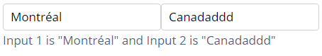
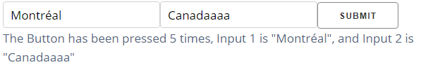

## Part3 Callback with State

使用`dash.dependencies.State`允许在不触发回调函数的情况下传递额外的值，就相当于把值暂存在state里

比如之前，只要输入框中的值改动，底下的div的内容就会跟着变动

但是现在，输入框的值变动不会直接影响底下的div，只有点击提交按钮后，才会触发回调函数来更新div内容，但是即使不触发回调函数本身，`dcc.Input`的当前值仍会传入回调函数

通过监听`html.Button`组件的`n_click`属性来触发回调函数，该属性在每次单击组件时都会增加，每个`dash_html_components`库中的组件都有该属性。

