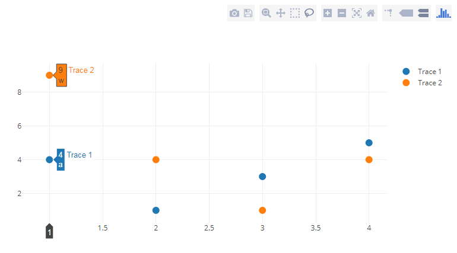
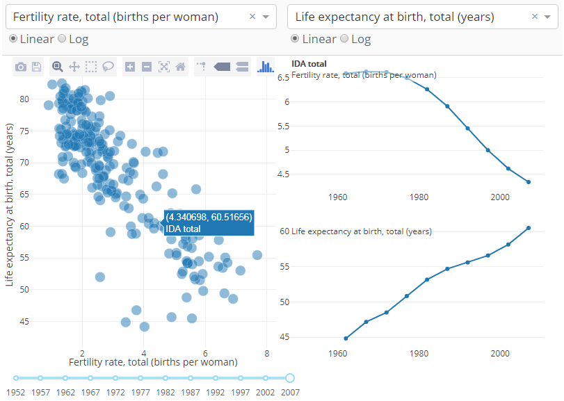
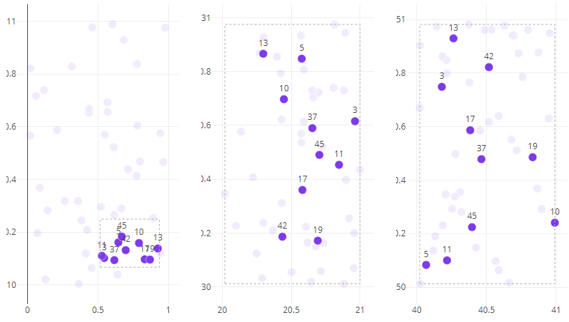

## Part4 交互式可视化

`dash_core_components`库包含一个名为`Graph`的组件

`dcc.Graph`组件具有四个可以通过用户交互进行更改的属性：`hoverData`，`clickData`，`selectedData`，`relayoutData`。当将鼠标悬停、单击点或在图形中选择点的区域时，这些属性会更新，将交互活动绑定到Dash Graph组件上。

#### 鼠标悬停时更新图

当鼠标滑过散点图上的点时，右边的线条图是根据鼠标悬停的点来更新的

#### 交叉过滤

在第一个图上选择散点，根据所选的点来读取Pandas数据框架，并重新显示图形，选中的地方被高亮显示，并且用虚线框圈住，这样一来可以在另外的两个图形上过滤出刚刚选择的散点。

##### 目前的限制

* 不能累积点击过的点，而且点击后，没有取消选择的概念
* 目前无法自定义悬停时出现的框和选择框的样式

