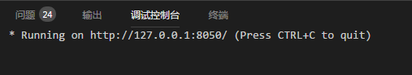
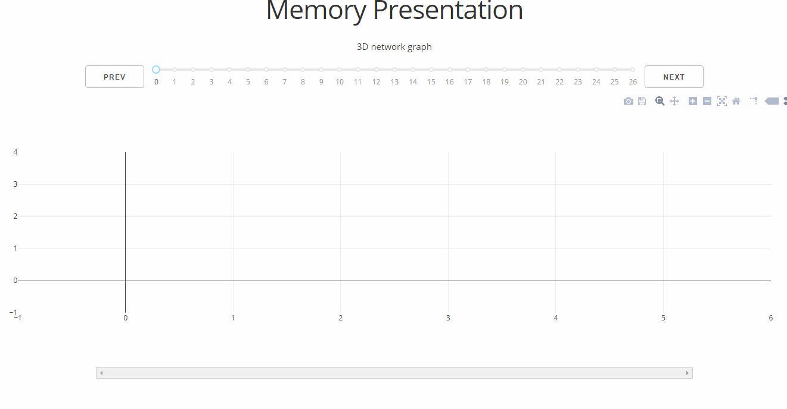
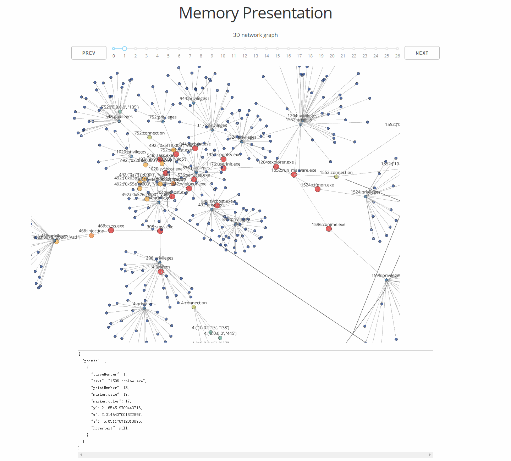

#### 安装dash

```
pip install dash==0.21.0  # 核心dash后端
pip install dash-renderer==0.12.1  # dash前端
pip install dash-html-components==0.10.0  # HTML组件
pip install dash-core-components==0.22.1  # Supercharged components
pip install plotly --upgrade  # Plotly 图形库
```

#### 安装igraph

需要安装igraph

在windows上安装igraph不能直接通过`pip install python-igraph`命令来安装

安装步骤：

1. 在这个[网址](https://www.lfd.uci.edu/~gohlke/pythonlibs/)里下载对应python版本的igraph的whl文件，我是32位windows的python2.7

2. 在命令行中pip安装刚刚下载的文件，文件名应该写全路径

   `pip install C:\Users\xxx\Downloads\python_igraph-0.7.1.post6-cp27-none-win32.whl`

#### 使用

运行dash_networkGraph.py文件，直到出现：



打开浏览器，在地址栏输入127.0.0.1:8050，就会出现如下画面：



这个时候要等一下，这个图是dash默认的初始图，因为生成网图有点慢。等半分钟后会自动更新这个初始图，如下：



点击结点会在底下显示具体信息，每次点击next都要等半分钟左右才会更新图